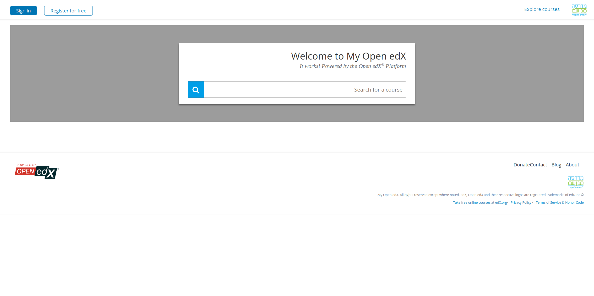

# installing madrase LMS locally on ubuntu 24.04.02 (Python 3.12.2)

I have docker already installed.
To make sure docker is correctly installed you should be able to run
(WITHOUT SUDO)

```
docker run hello-world
```
If you are able to run it only with `sudo` this is not enough.
you should follow the instructions here to be able to run withtout sudo:

https://docs.docker.com/engine/install/linux-postinstall/#manage-docker-as-a-non-root-user

1. I first just install tutor:

```
python3 -m venv env
source env/bin/activate
pip install 'tutor[full]'
```

now we can run:
```
(env) 6.8dafna@guri:~$ tutor --version
tutor, version 18.2.2
```


now we run `tutor local launch`

I got some things starting to run but at the end I en error:

```
(env) 6.8dafna@guri:~$ tutor local launch
==================================================
        Interactive platform configuration
==================================================
Are you configuring a production platform? Type 'n' if you are just testing Tutor on your local computer [y/N] n
As you are not running this platform in production, we automatically set the following configuration values:
    LMS_HOST = local.edly.io
    CMS_HOST = studio.local.edly.io
    ENABLE_HTTPS = False
Your platform name/title [My Open edX] 
Your public contact email address [contact@local.edly.io] 
The default language code for the platform [he]   
Configuration saved to /home/dafna/.local/share/tutor/config.yml
Environment generated in /home/dafna/.local/share/tutor/env
======================================
        Building Docker images
======================================
No image to build
==============================================
        Stopping any existing platform
==============================================
docker compose -f /home/dafna/.local/share/tutor/env/local/docker-compose.yml -f /home/dafna/.local/share/tutor/env/local/docker-compose.prod.yml --project-name tutor_local stop
======================================================
        Starting the platform in detached mode
======================================================
docker compose -f /home/dafna/.local/share/tutor/env/local/docker-compose.yml -f /home/dafna/.local/share/tutor/env/dev/docker-compose.yml --project-name tutor_dev stop
docker compose -f /home/dafna/.local/share/tutor/env/local/docker-compose.yml -f /home/dafna/.local/share/tutor/env/local/docker-compose.prod.yml --project-name tutor_local up --remove-orphans -d
[+] Running 96/107
[+] Running 107/107d                                                                            196.8s 
 ✔ cms-worker Pulled                                                                            196.8s 
 ✔ mysql Pulled                                                                                 235.8s 
 ✔ smtp Pulled                                                                                  125.4s 
 ✔ redis Pulled                                                                                 132.8s 
 ✔ lms Pulled                                                                                   196.8s 
 ✔ mongodb Pulled                                                                               237.3s 
 ✔ lms-worker Pulled                                                                            196.8s 
 ✔ cms Pulled                                                                                   196.8s 
 ✔ caddy Pulled                                                                                 124.4s 
 ✔ mfe Pulled                                                                                   249.8s 
 ✔ permissions Pulled                                                                           213.8s 
 ✔ elasticsearch Pulled                                                                         208.3s 
[+] Running 12/13
 ✔ Network tutor_local_default            Created                                                 0.0s 
 ✔ Container tutor_local-smtp-1           Started                                                 0.9s 
 ✔ Container tutor_local-permissions-1    Started                                                 1.0s 
 ⠋ Container tutor_local-caddy-1          Starting                                                1.2s 
 ✔ Container tutor_local-mysql-1          Started                                                 0.9s 
 ✔ Container tutor_local-mongodb-1        Started                                                 0.5s 
 ✔ Container tutor_local-elasticsearch-1  Started                                                 0.5s 
 ✔ Container tutor_local-redis-1          Started                                                 0.5s 
 ✔ Container tutor_local-lms-1            Created                                                 0.0s 
 ✔ Container tutor_local-mfe-1            Created                                                 0.0s 
 ✔ Container tutor_local-lms-worker-1     Created                                                 0.0s 
 ✔ Container tutor_local-cms-1            Created                                                 0.0s 
 ✔ Container tutor_local-cms-worker-1     Created                                                 0.0s 
Error response from daemon: failed to set up container networking: driver failed programming external connectivity on endpoint tutor_local-caddy-1 (026907d7e5a86d974483137e5bf84aab966c5d36e2ea16d0f0a3ed2cb1679ee5): failed to bind host port for 0.0.0.0:80:172.18.0.3:80/tcp: address already in use
Error: Command failed with status 1: docker compose -f /home/dafna/.local/share/tutor/env/local/docker-compose.yml -f /home/dafna/.local/share/tutor/env/local/docker-compose.prod.yml --project-name tutor_local up --remove-orphans -d
```

It says my localhost address on port 80 is already in use. Apparently for some reason I have 
lighthttpd service running on my laptop. So I had to stop it:
```
sudo systemctl stop lighttpd.service
```
then running again:
```
tutor local launch
```

It does lot's of things, taking few minutes, and it ends with typing to the screen:

```
All services initialised.
The platform is now running and can be accessed at the following urls:

    http://local.edly.io
    http://studio.local.edly.io
    http://apps.local.edly.io
```

now you should be able to go to those links in your browser.
The madrase extensions are here https://github.com/madrasafree/

Open edX Developer Onboarding :

https://training.openedx.io/courses/course-v1:OpenedX+OEX-Dev101+2024/about

a good intro to `tutor`:
https://www.youtube.com/watch?v=BzNcrm$jyFpw4

So now if we run `docker ps` we see lots of running docker images related to the installed openedx

tutor documentation:
https://docs.tutor.edly.io/

I chose Hebrew when asked for the language of the openedx installed.
And I can see that when typing:

```
$ tutor config printvalue LANGUAGE_CODE
he
```

to change the language to say english I can do:
```
$ tutor config save --set LANGUAGE_CODE=en
Configuration saved to /home/dafna/.local/share/tutor/config.yml
Environment generated in /home/dafna/.local/share/tutor/env
```
now we run:
```
(env) 6.8dafna@guri:~$ tutor config printroot
/home/dafna/.local/share/tutor
```
"Template Rendering" is the process of replacing varaibles with their actual values.
"The project environment" is the 'env' directory.
in my case it is '~/.local/share/tutor/env'
that env directoy can be recreated whenever we run `tutor config save`.
we should never change the files in the 'env' folder, since the files are generated and
are not manually written.

### Tutor plugins
follow this to understand Tutor plugins:
https://edly.io/academy/tutor-plugins/


interestingly, when running `tutor plugins list` , I see a madrse plugin called
`madrasa_hebrew`. Among many others.
I have this installed:
https://github.com/madrasafree/tutor-contrib-madrasa-hebrew


I have this installed:
https://github.com/madrasafree/tutor-contrib-madrasa-hebrew


#### Creating a Tutor plugin
Again, I follow
https://edly.io/academy/tutor-plugins/

```
pip install cookiecutter
```
and so on...


Let's install another madrasafree plugin:
https://github.com/madrasafree/tutor-indigo-madrasa

```
git clone https://github.com/madrasafree/tutor-indigo-madrasa.git
cd tutor-indigo-madrasa
pip install -e ./tutor-indigo-madrasa/
```

now tutor should already be able to discover the plugin. It should be listed when running:
```
tutor plugins list
```
And now we do the same to install the plugin.
https://github.com/madrasafree/tutor-contrib-madrasa-branding.git

Let's look at this plugin. As to writing this README, this plugin has only 3 commits:

```
(env) 6.8 (open-release/redwood.master)dafna@guri:~/git/madrase/tutor-contrib-madrasa-branding$ gl
2025-03-07 - 022f9f2 -  (HEAD -> open-release/redwood.master, tag: 18.0.1, origin/open-release/redwood.master, origin/main, origin/HEAD) docs: add inline comments to track where these settings are added <lpm0073>
2025-03-06 - 224879e -  (tag: 18.0.0) chore: set logo urls <lpm0073>
2025-03-06 - f255100 -  first commit <lpm0073>
```
First commit is not interesting. It is generated by that cookiecutter tool for generating
tutor plugins.
Let's look at the second commits:
```

(env) 6.8 (open-release/redwood.master)dafna@guri:~/git/madrase/tutor-contrib-madrasa-branding$ git show 224879e | cat
commit 224879eaca798987ff8c94765ec0ee85b3f58cc4
Author: lpm0073 <lpm0073@gmail.com>
Date:   Thu Mar 6 09:06:07 2025 -0600

    chore: set logo urls

diff --git a/madrasa_branding/patches/mfe-lms-common-settings b/madrasa_branding/patches/mfe-lms-common-settings
new file mode 100644
index 0000000..96ee952
--- /dev/null
+++ b/madrasa_branding/patches/mfe-lms-common-settings
@@ -0,0 +1,4 @@
+MFE_CONFIG["LOGO_URL"] = "https://madrasafree.com/wp-content/uploads/2022/02/logo.png"
+MFE_CONFIG["LOGO_TRADEMARK_URL"] = "https://madrasafree.com/wp-content/uploads/2022/02/logo.png"
+MFE_CONFIG["LOGO_WHITE_URL"] = "https://madrasafree.com/wp-content/uploads/2022/02/logo.png"
+MFE_CONFIG["FAVICON_URL"] = "https://madrasafree.com/wp-content/uploads/2022/02/logo-100x100.png"
diff --git a/madrasa_branding/patches/openedx-common-settings b/madrasa_branding/patches/openedx-common-settings
new file mode 100644
index 0000000..687b1e8
--- /dev/null
+++ b/madrasa_branding/patches/openedx-common-settings
@@ -0,0 +1,12 @@
+GOOGLE_ANALYTICS_ACCOUNT = 'GTM-NBXRS2T'
+GOOGLE_ANALYTICS_TRACKING_ID = 'GTM-NBXRS2T'
+# GOOGLE_ANALYTICS_LINKEDIN
+# GOOGLE_SITE_VERIFICATION_ID
+# GOOGLE_ANALYTICS_4_ID
+
+LOGO_IMAGE_EXTRA_TEXT = "Madrasa Free logo"
+LOGO_URL = "https://madrasafree.com/wp-content/uploads/2022/02/logo.png"
+LOGO_URL_PNG = "https://madrasafree.com/wp-content/uploads/2022/02/logo.png"
+LOGO_TRADEMARK_URL = "https://madrasafree.com/wp-content/uploads/2022/02/logo.png"
+FAVICON_URL = "https://madrasafree.com/wp-content/uploads/2022/02/logo-100x100.png"
+DEFAULT_EMAIL_LOGO_URL = "https://madrasafree.com/wp-content/uploads/2022/02/logo.png"

```
it adds two new files that the `patches` directory.
The files are: `mfe-lms-common-settings`, and `openedx-common-settings`

yada yada yada. After running `tutor local restart all` and reloading the link
http://local.edly.io/
I see the madrasa logo at the upper right corner.

Now , installing the madarsa theme is also easy.
This is the link:
https://github.com/madrasafree/madrasa-theme

The instruction on how to install are directly in the readme.

```
git clone git@github.com:madrasafree/madrasa-theme.git \
  "$(tutor config printroot)/env/build/openedx/themes/madrasa-theme"
tutor images build openedx
tutor local do settheme madrasa-theme
```
ok, now my link http://local.edly.io/ looks like this:


